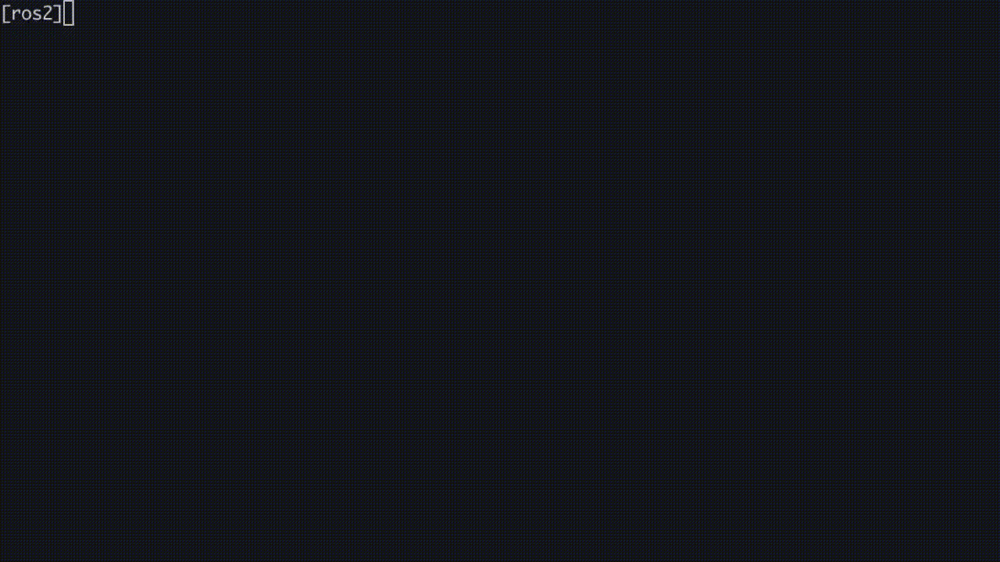

# ros2-docker

## 1. Overview
This project is an unofficial project. This specific fork from the [original](https://github.com/masato-ka/ros2-docker) is a version for ROS2 Humble.
This is a support script for easily ROS2+Docker development, so you can develop a ROS2 application without any native ROS2 environment. 



## 2. Requirement

* Docker
* Operation system is macOS or Linux

## 3. Install

Install isn't needed. Just build a docker image for ros2:

```
git clone https://github.com/IlAnP7L24/ros2-docker
cd ros2-docker/app_build_container
docker build -t <Own docker image name> .
cd ../
sudo chmod +x ros2-docker.sh
export PATH=$PATH:$PWD/ros2-docker
```

## 4. Usage

### command overview

```$ros-docker.sh [Options] <workspace> <command> [Command Options]```

|Options |Description |
|:-----------------------------|:-----------------------------|
|-i [container image name]      | Set a custom Docker image to be used when executing the command.|
|-g                             | Used to run ros2 run or launch with GUI.|
|-t [container image name]      | Set the name of the docker image to be created when rosdep is executed.                     |


|command| Description |
|:-------|------------|
|create  | create ros pkg.|
|build   | build ros pkg.|
|run     | run ros node. |
|launch  | launch ros launch file|
|bundle  | bundle ros package.|
|vcs     | run vcs            |
|rosdep  | run rosdep             |
|rviz    | run rviz               |
|gazebo  | run gazebo                    |


### For example

* 1.Running ROS2 tutorial [Trying dummy robot demo](https://index.ros.org/doc/ros2/Tutorials/dummy-robot-demo/).

```
mkdir -p ros_ws/src
git clone https://github.com/ros2/demos.git　./ros_ws/src
cd ros_ws/src/demo && git checkout humble
cd ../../
ros2-docker.sh -o ros2-sample-image:latest ros_ws rosdep install --from-paths src --ignore-src -r -y
ros2-docker.sh -i ros2-sample-image ros_ws build
ros2-docker.sh ros_ws launch dummy_robot_bringup dummy_robot_bringup.launch.py
## Other terminal
ros2-docker.sh ros_ws rviz

## You can see rviz by VNC (localhost:5900).
```

* 2.[Moveit2 build and demo run](https://moveit.ros.org/install-moveit2/source/)
```
mkdir -p moveit_ws/src
curl wget https://raw.githubusercontent.com/ros-planning/moveit2/main/moveit2.repos -o moveit_ws/.rosintall
ros2-docker moveit_ws vcs
## Attention: You need all download directory move to src folder manually.

## rosdep subcommand create new docker image that is resolve dependencies for moveit. 
ros2-docker -t moveit_depends_image moveit_ws rosdep install -r --from-paths . --ignore-src --rosdistro humble -y

## Take many time for build.
## Attention: Builded pkg is not contain in docker image. Therefor if you need moveit for your own pkg, create new docker image manually.
ros2-docker -i moveit_depends_image moveit_ws build --event-handlers desktop_notification- status- --cmake-args -DCMAKE_BUILD_TYPE=Release
 
## You 
ros20docker -i moveit_depends_image -g ros2 launch run_moveit_cpp run_moveit_cpp.launch.py
## You can see rviz by VNC (localhost:5900).
```

* **<font name="red">Attention</font>**

If VNC show black screen you need change rviz setting. 
Please open file ```moveit_ws/install/run_moveit_cpp/share/run_moveit_cpp/launch/run_moveit_cpp.rviz``` with some editor.
Then change to 0 Window Geometry X and Y.


### Create ros2 package

Execute ros2 create commmand to workspace/src directory.

```
mkdir -p workspace/src
ros2-docker.sh workspace create <pkg_name> --build-type ament_cmake --node-name own_node
```

### Build package

Execute ros2 build command to workspace.

```
ros2-docker.sh workspace build
```

### Run node

Execute ros2 run command to run your own node.

```
ros2-docker.sh workspace run <pkg_name> <node_name>
```

If your own node need X display.

```
ros2-docker -g workspace run <pkg_name> <node_name>
```
After connect localhost:5900 by VNC tool(macOS recommend Tiger VNC.)

### Launch

Execute ros2 launch command to run your own launch file.

```
ros2-docker.sh workspace launch <pkg_name> <launch file>
```

If you contain gui application in your launch file.

```
ros2-docker.sh -g workspace launch <pkg_name> <node_name>
```

After connect localhost:5900 by VNC tool(macOS recommend Tiger VNC.)

## Rviz

Execute the rviz command to run the rviz GUI, which will be drawn on a 
virtual buffer in X Window and served outside the container via VNC from port 5900.

```
ros2-docker.sh workspace rviz
```
After connect localhost:5900 by VNC tool (macOS recommend Tiger VNC.)

## Gazebo

Execute the gazebo command to run the gazebo GUI, which will be drawn on a 
virtual buffer in X Window and served outside the container via VNC from port 5900.

```
ros2-docker.sh workspace gazebo
```
Connect to localhost:5900 through a VNC tool (Tiger VNC is recommended for macOS)

## vcs import

Run vcs import < .rosinstall under the specified workspace. 
The current version will only process .rosinstall files under the workspace.

```
.rosinstall if it exists directly under the workspace
ros2-docker.sh workspace vcs
```

## rosdep 

Run the rosdep command under the workspace to resolve the dependency. 
Create a new Docker image containing the resolved dependencies with the name specified by -o.

```
ros2-docker.sh -o <new docker image name> <workspacename> \
rosdep install -r --from-paths . --ignore-src --rosdistro humble -y 
```

## 5. Release note

* 2021/01/30 version 0.1.0
 First release shell script version. 


## 6. Contribution

If you find bug or want to new functions, please write issue.

If you fix your self, please fork and send pull request.

## 7. LICENSE

This software license under MIT licence.


## 8. Author 

[masato-ka](https://github.com/masato-ka/ros2-docker)
